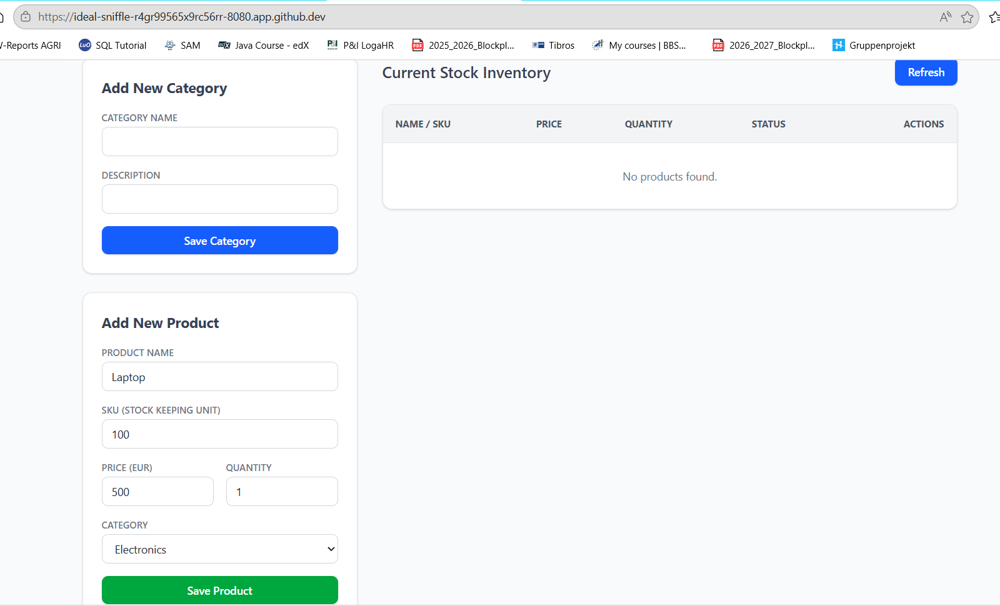
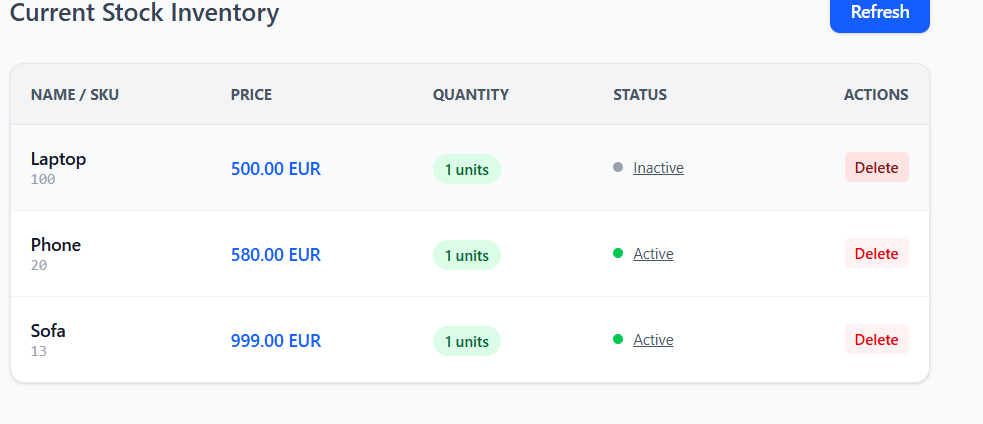
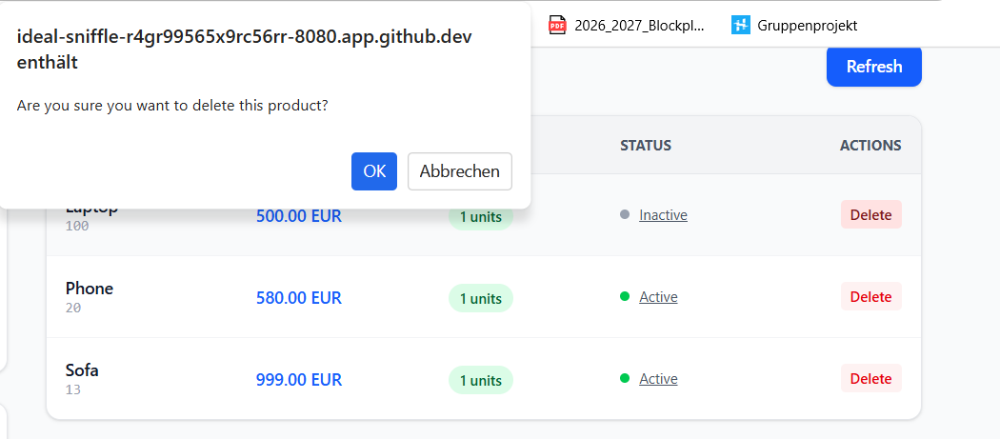
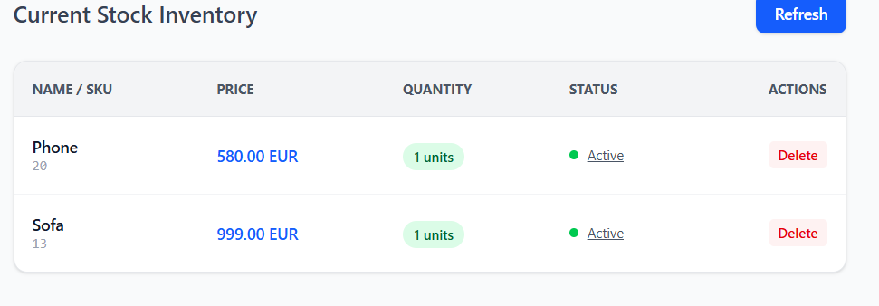
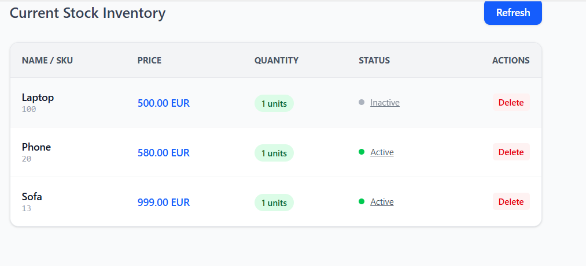

# Inventory Management API

A Spring Boot REST API for managing products and categories in a warehouse system.

## Architecture Overview

```
HTTP Request
     ↓
Controller        ← handles HTTP, validates input, returns HTTP responses
     ↓
Service           ← business logic, transactions, orchestration
     ↓
Repository        ← database access (Spring Data JPA)
     ↓
Database (PostgreSQL)
```

**DTOs** flow between Controller ↔ Service  
**Entities** flow between Service ↔ Repository

---

## How to Run

### With Docker (recommended)

```bash
# Build and start everything (app + database)
docker-compose up --build

# Run in background
docker-compose up --build -d

# Stop everything
docker-compose down

# Stop and DELETE the database volume ( wipes all data)
docker-compose down -v
```

The API will be available at: `http://localhost:8080`

### Without Docker (local development)

Requires: Java 17, Maven, PostgreSQL running locally.

```bash
# Update application.properties DB settings to point to your local Postgres
mvn spring-boot:run
```

---

## API Reference

### Categories

| Method | Endpoint                          | Description                    | Status |
|--------|-----------------------------------|--------------------------------|--------|
| GET    | `/api/categories`                 | All categories (paginated)     | 200    |
| GET    | `/api/categories/active`          | Active categories only         | 200    |
| GET    | `/api/categories/{id}`            | Get category by ID             | 200    |
| POST   | `/api/categories`                 | Create category                | 201    |
| PUT    | `/api/categories/{id}`            | Update category                | 200    |
| DELETE | `/api/categories/{id}`            | Delete category                | 204    |
| PATCH  | `/api/categories/{id}/toggle-active` | Toggle active/inactive      | 200    |

### Products

| Method | Endpoint                          | Description                    | Status |
|--------|-----------------------------------|--------------------------------|--------|
| GET    | `/api/products`                   | All products (paginated, filterable) | 200 |
| GET    | `/api/products/active`            | Active products only           | 200    |
| GET    | `/api/products/{id}`              | Get product by ID              | 200    |
| POST   | `/api/products`                   | Create product                 | 201    |
| PUT    | `/api/products/{id}`              | Update product                 | 200    |
| DELETE | `/api/products/{id}`              | Delete product                 | 204    |
| PATCH  | `/api/products/{id}/toggle-active` | Toggle active/inactive        | 200    |

---

## Filtering & Pagination

Products endpoint supports query parameters:

```
GET /api/products?categoryId=1&active=true&minPrice=10&maxPrice=100&minQty=1&search=laptop&page=0&size=20&sort=price,asc
```

| Parameter    | Type    | Description                        |
|--------------|---------|------------------------------------|
| `categoryId` | Long    | Filter by category ID              |
| `active`     | Boolean | Filter by active status            |
| `minPrice`   | Decimal | Minimum price                      |
| `maxPrice`   | Decimal | Maximum price                      |
| `minQty`     | Integer | Minimum quantity                   |
| `maxQty`     | Integer | Maximum quantity                   |
| `search`     | String  | Search in product name             |
| `page`       | Integer | Page number (0-indexed, default 0) |
| `size`       | Integer | Items per page (default 10)        |
| `sort`       | String  | Field and direction e.g. `name,asc`|

---

## Example Requests

### Create a category
```http
POST /api/categories
Content-Type: application/json

{
  "name": "Electronics",
  "description": "Electronic devices and accessories"
}
```

### Create a product
```http
POST /api/products
Content-Type: application/json

{
  "name": "Laptop Pro 15",
  "description": "High-performance laptop",
  "price": 1299.99,
  "quantity": 50,
  "sku": "LAP-PRO-15",
  "categoryId": 1
}
```

### Filter products
```http
GET /api/products?categoryId=1&minPrice=100&maxPrice=2000&active=true&page=0&size=10
```

---

## Pagination Response Format

```json
{
  "content": [...],
  "pageable": {
    "pageNumber": 0,
    "pageSize": 10
  },
  "totalElements": 42,
  "totalPages": 5,
  "last": false,
  "first": true
}
```

---

## Error Response Format

```json
{
  "timestamp": "2024-01-15T10:30:00",
  "status": 400,
  "error": "Bad Request",
  "message": "Validation failed",
  "fieldErrors": {
    "name": "must not be blank",
    "price": "must be greater than 0"
  }
}
```

---

## User experience
User can also add, delete, modify, deactivate data in simple html based website, which looks like this: 












## Key Concepts Covered

- **Clean Architecture**: Controller → Service → Repository separation
- **DTOs**: Request/Response objects separate from database entities
- **JPA Relations**: One-to-Many (Category → Products) with `@OneToMany` / `@ManyToOne`
- **Active Flag**: Soft disable pattern; `/active` endpoint for customers, main endpoint for admins
- **Pagination**: `Pageable` + `Page<T>` with Spring Data Web support
- **Filtering**: Multi-parameter optional JPQL query
- **Validation**: Bean Validation (`@NotBlank`, `@Min`, `@DecimalMin`, etc.)
- **Global Exception Handling**: `@RestControllerAdvice` with consistent JSON errors
- **Docker**: Multi-stage Dockerfile, docker-compose with health checks and named volumes
